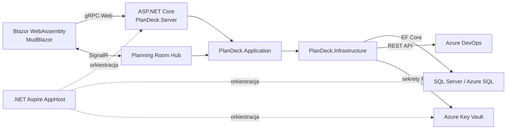

# PlanDeck

[](https://github.com/LeszekDNV/PlanDeck2/actions/workflows/azure-develop.yml)
[](https://github.com/LeszekDNV/PlanDeck2/actions/workflows/azure-dev.yml)
[](https://github.com/LeszekDNV/PlanDeck2/actions/workflows/ai-code-review.yml)
[](LICENSE)
[](https://dotnet.microsoft.com/)

**PlanDeck** to webowa aplikacja do prowadzenia sesji Planning Poker dla zespołów SCRUM. Pozwala przygotować zadania, zaprosić uczestników, przeprowadzić głosowanie w czasie rzeczywistym i zapisać uzgodnioną estymatę z powrotem w Azure DevOps.

[Otwórz publiczne środowisko testowe](https://plandeck-server.wittymeadow-96369440.polandcentral.azurecontainerapps.io/)

> [!NOTE]
> Projekt jest rozwijanym MVP i środowiskiem pilotażowym. Gałęzie `develop` oraz `main` wdrażają obecnie aplikację do współdzielonego środowiska **Testing** w Azure. Osobne wdrożenie produkcyjne pozostaje kolejnym etapem.

## Najważniejsze możliwości

- konta lokalne z potwierdzaniem adresu e-mail, odzyskiwaniem hasła i opcjonalnym logowaniem przez Microsoft Entra ID,
- projekty z rolami Owner, Admin i Member oraz przypisywaniem zespołów i użytkowników,
- zespoły i członkostwa izolowane pomiędzy tenantami,
- sesje planistyczne z zadaniami ad-hoc, importem z Azure DevOps oraz skalami Fibonacci, T-shirt i własną,
- głosowanie przez SignalR: ukryte wartości, status oddania głosu, jednoczesne odkrycie, reset rundy i wybór uzgodnionej estymaty,
- udział gości przez link z kodem sesji i tymczasową nazwą, bez zakładania konta,
- zapis uzgodnionej estymaty do właściwego Work Itemu w Azure DevOps,
- interfejs oparty na MudBlazor z lokalizacją angielską i polską.

## Architektura

PlanDeck jest hostowaną aplikacją Blazor WebAssembly. `PlanDeck.Server` udostępnia klienta WASM, endpointy code-first gRPC przez gRPC-Web oraz hub SignalR jako jedną jednostkę wdrożeniową.



| Obszar | Technologia |
| --- | --- |
| Runtime | .NET 10, C# |
| UI | Blazor WebAssembly, MudBlazor 9 |
| API | code-first gRPC, `protobuf-net.Grpc`, gRPC-Web |
| Czas rzeczywisty | ASP.NET Core SignalR |
| Dane | EF Core 10, SQL Server / Azure SQL |
| Tożsamość | ASP.NET Core Identity, Microsoft Entra ID |
| Orkiestracja | .NET Aspire 13 |
| Testy | NUnit 4, Playwright |
| Hosting | Azure Container Apps, Azure SQL, Azure Key Vault |

Stan aktywnych pokojów głosowania jest obecnie przechowywany w pamięci procesu. Z tego powodu środowisko pilotażowe działa na jednej replice Azure Container Apps z włączonym session affinity. Skalowanie horyzontalne wymaga najpierw zewnętrznego backplane'u lub Azure SignalR Service.

## Struktura repozytorium

```text
.
├── .github/workflows/             # GitHub Actions: przegląd PR i wdrożenia
├── context/                       # PRD, roadmapa, decyzje i historia zmian
└── src/PlanDeck/
    ├── Aspire/
    │   ├── PlanDeck.AppHost/      # punkt startowy i model zasobów
    │   └── PlanDeck.ServiceDefaults/
    ├── Core/
    │   ├── PlanDeck.Application/  # przypadki użycia i usługi gRPC
    │   ├── PlanDeck.Common/
    │   ├── PlanDeck.Core.Shared/  # współdzielone kontrakty i DTO
    │   └── PlanDeck.Infrastructure/
    ├── Web/
    │   ├── PlanDeck.Client/       # klient Blazor WASM
    │   └── PlanDeck.Server/       # host ASP.NET Core
    ├── Tests/
    │   ├── PlanDeck.Unit.Tests/
    │   ├── PlanDeck.Integration.Tests/
    │   └── PlanDeck.E2e.Tests/
    └── PlanDeck.slnx
```

## Wymagania

- [.NET SDK 10.0.301](https://dotnet.microsoft.com/download), zgodny z `src/PlanDeck/global.json`,
- [Podman](https://podman.io/) z uruchomioną maszyną kontenerową,
- [Azure CLI](https://learn.microsoft.com/cli/azure/install-azure-cli) i dostęp do subskrypcji Azure; lokalny AppHost używa dedykowanego nieprodukcyjnego Key Vault,
- PowerShell 7, jeśli mają być uruchamiane testy Playwright.

## Uruchomienie lokalne

Wykonaj polecenia z katalogu `src\PlanDeck`:

```powershell
Set-Location src\PlanDeck

az login
$subscriptionId = az account show --query id --output tsv
dotnet user-secrets set "Azure:SubscriptionId" $subscriptionId --project Aspire\PlanDeck.AppHost
dotnet user-secrets set "Azure:Location" "polandcentral" --project Aspire\PlanDeck.AppHost

podman machine start
dotnet restore PlanDeck.slnx
dotnet run --project Aspire\PlanDeck.AppHost
```

Aspire uruchomi aplikację, SQL Server i MailPit oraz wyświetli adres dashboardu. Aplikacja korzysta ze stałego lokalnego adresu `https://localhost:7443`. Jeśli certyfikat deweloperski nie jest jeszcze zaufany:

```powershell
dotnet dev-certs https --trust
```

Logowanie kontem lokalnym działa bez konfiguracji Entra ID. Wiadomości potwierdzające konto i resetujące hasło można odczytać w MailPit przez link widoczny w dashboardzie Aspire.

## Konfiguracja Azure DevOps

Po zalogowaniu konfiguracja jest wykonywana z poziomu szczegółów projektu:

1. Utwórz projekt i otwórz jego szczegóły.
2. Podaj adres organizacji Azure DevOps, nazwę projektu i mapowanie pól.
3. Wprowadź Personal Access Token z minimalnym wymaganym zakresem dostępu do Work Items.
4. Zaimportuj zadania do sesji, przeprowadź głosowanie i zapisz uzgodnioną estymatę.

Tokeny PAT nie są zapisywane w repozytorium ani w bazie aplikacji. PlanDeck przechowuje je w Azure Key Vault, a w bazie utrzymuje wyłącznie odwołanie do sekretu.

## Budowanie i testy

```powershell
Set-Location src\PlanDeck

dotnet build PlanDeck.slnx
dotnet test Tests\PlanDeck.Unit.Tests\PlanDeck.Unit.Tests.csproj
dotnet test Tests\PlanDeck.Integration.Tests\PlanDeck.Integration.Tests.csproj
```

Testy E2E samodzielnie uruchamiają pełny AppHost, dlatego wymagają działającego Podmana, konfiguracji Azure z sekcji uruchomienia lokalnego oraz zainstalowanej przeglądarki Playwright:

```powershell
dotnet build Tests\PlanDeck.E2e.Tests\PlanDeck.E2e.Tests.csproj
pwsh Tests\PlanDeck.E2e.Tests\bin\Debug\net10.0\playwright.ps1 install chromium
dotnet test Tests\PlanDeck.E2e.Tests\PlanDeck.E2e.Tests.csproj
```

Pełny zestaw można uruchomić poleceniem:

```powershell
dotnet test PlanDeck.slnx
```

## CI/CD i wdrożenia

| Workflow | Wyzwalacz | Cel |
| --- | --- | --- |
| `azure-develop.yml` | push do `develop` lub ręcznie | środowisko Azure `Testing` |
| `azure-dev.yml` | push do `main` lub ręcznie | pilot w środowisku Azure `Testing` |
| `ai-code-review.yml` | pull request do `develop` | doradczy przegląd statycznego diffu |

Workflowy wdrożeniowe używają federacji OIDC zamiast długotrwałego sekretu do logowania w Azure. Pipeline:

1. waliduje konfigurację Microsoft Entra ID,
2. provisionuje infrastrukturę przez Aspire i `azd`,
3. czeka na gotowość Azure SQL,
4. stosuje idempotentne migracje EF Core,
5. wdraża aplikację do Azure Container Apps,
6. sprawdza gotowość rewizji i endpoint `/health`.

Model infrastruktury znajduje się w `src/PlanDeck/Aspire/PlanDeck.AppHost/AppHost.cs`, a konfiguracja usługi dla Azure Developer CLI w `src/PlanDeck/azure.yaml`.

## Dokumentacja projektu

- [PRD](context/foundation/prd.md)
- [Roadmapa](context/foundation/roadmap.md)
- [Analiza infrastruktury](context/foundation/infrastructure.md)
- [Plan wdrożenia](context/deployment/deploy-plan.md)
- [Historia ukończonych zmian](context/archive/)

## Licencja

Projekt jest udostępniany na licencji [GNU General Public License v3.0](LICENSE).
